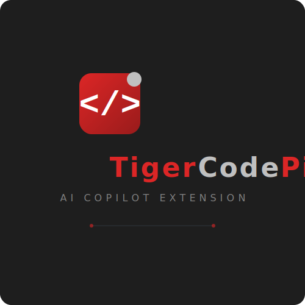
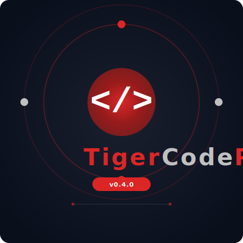

# Tiger Code Pilot

  

  
  &nbsp;&nbsp;
  

Tiger Code Pilot is an open-source, agentic AI Copilot extension for VS Code that supports OpenAI, Hugging Face, Ollama, and local model endpoints. It provides multi-mode AI workflows with a prompt-based local/cloud model manager and reword capability.

## Features

- Mode-based assistant: brainstorm, research, develop, code-debug, write/complete code, design-project
- Provider switch: OpenAI, HuggingFace, Ollama, local HTTP endpoint
- Model select for provider: gpt-4o-mini, llama2, etc.
- Code context textbox for snippet + selected code
- Reword prompt and copy prompt commands
- Output pane with AI response
- Commands:
  - `Tiger Code Pilot: Open Chat`
  - `Tiger Code Pilot: Analyze Code`

## Quick Start

1. Open folder in VS Code (`code-pilot-project`)
2. `npm install`
3. `npm run compile`
4. Press F5 to run Extension Development Host

## Usage

1. Run `Tiger Code Pilot: Open Chat` from command palette
2. Choose provider + model, set API key/endpoint
3. Paste code context / select code in editor
4. Enter prompt and run Copilot
5. Reword prompt and re-run as needed

## Environment

- Node 18+ (recommended 20+)
- npm 9+
- VS Code 1.90+
- API key for your chosen provider (OpenAI/HuggingFace) or local Ollama endpoint

## Packaging

- `npm run compile`
- `vsce package` to generate `.vsix`

## Open Source

Licensed under MIT.

## Contributing

Use GitHub issues/PRs. For AI content, follow responsible AI guidelines.
