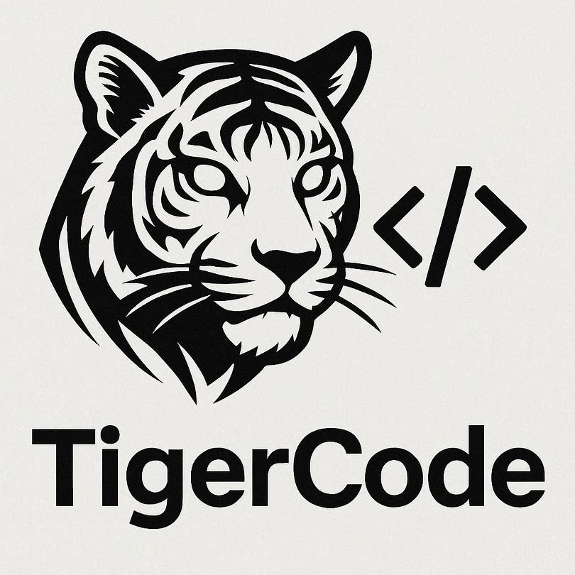

# Tiger Code Pilot

<p align="center">
  
</p>

<p align="center">
  <strong>AI-Powered Coding Assistant — VS Code Extension · CLI · MCP Server · Autonomous Agent</strong>
</p>

<p align="center">
  <a href="#features">Features</a> ·
  <a href="#architecture">Architecture</a> ·
  <a href="#quick-start">Quick Start</a> ·
  <a href="#cli-reference">CLI</a> ·
  <a href="#mcp-tools">MCP</a> ·
  <a href="#roadmap">Roadmap</a>
</p>

---

## Overview

**Tiger Code Pilot** is an open-source AI coding assistant designed for developers who want a local-first, multi-modal toolchain — from an IDE-integrated chat panel to an autonomous agent that can scaffold, implement, and commit complete features from a single high-level prompt. All inference runs on your own hardware — no data ever leaves your machine.

It ships as three surfaces backed by a single core engine:

| Surface | Description |
|---|---|
| **VS Code Extension** | Rich webview chat panel, context-aware code analysis, onboarding wizard |
| **CLI Tool** | Full-featured terminal interface with analyze, chat, vibecode, and server modes |
| **MCP Server** | Model Context Protocol implementation for Claude Desktop, Cursor, and compatible clients |

At the center sits the **Local Agent** — an autonomous planner that decomposes goals into executable steps: reading the codebase, generating files, running tests, applying fixes, and committing results. All powered by local models via Ollama, LM Studio, or any OpenAI-compatible local server.

---

## Features

### Local-First AI Provider Support
All inference runs on your own hardware. Connect to Ollama, LM Studio, or any OpenAI-compatible local HTTP endpoint (llama.cpp, text-generation-webui, etc.). No API keys, no data egress, no vendor lock-in.

### Vibecode Actions
Natural-language driven code workflows:

`generate` · `explain` · `refactor` · `debug` · `convert` · `document` · `test` · `optimize`

### Autonomous Local Agent
Give the agent a goal — *"create a REST API in Python"* — and it plans and executes the full workflow: project scaffolding, model design, route generation, test writing, execution, and self-correction on failures. All file operations are sandboxed to the working directory.

### Model Context Protocol (MCP)
Exposes tools (`analyze_code`, `generate_code`, `read_file`, `write_file`, `list_directory`, `chat`, etc.) over stdio for MCP-compatible clients, or as a REST API over HTTP.

### Concept-to-Reality Sessions
An interactive guided mode where you describe what you want to build and the agent asks clarifying questions, then builds the project step by step — with user confirmation at each milestone.

### Local Model Catalog
Download and run models offline via Ollama or LM Studio. Supported models include DeepSeek Coder, StarCoder2, Llama 3.2, Phi-3 Mini, and Qwen — ranging from 1 GB to 5 GB.

---

## Architecture

```
┌─────────────┐  ┌──────────────┐  ┌──────────────────┐
│  CLI Tool   │  │ VS Code Ext  │  │   Local Agent    │
│  (stdio)    │  │  (webview)   │  │   (autonomous)   │
└──────┬──────┘  └──────┬───────┘  └────────┬─────────┘
       │                │                    │
       └────────────────┼────────────────────┘
                        │
               ┌────────▼────────┐
               │  Core Engine    │
               │  (AI Router)    │
               └────────┬────────┘
                        │
       ┌────────────────┼────────────────┐
       │                │                 │
┌──────▼──────┐  ┌─────▼──────┐  ┌───────▼────────┐
│ HTTP Server │  │ MCP Server │  │ Plugin System  │
│  (REST API) │  │  (stdio)   │  │  (extensible)  │
└──────┬──────┘  └──────┬─────┘  └───────┬────────┘
       │                │                 │
       └────────────────┼─────────────────┘
                        │
               ┌────────▼────────┐
               │ Provider Layer  │
               │  (AI Models)    │
               └────────┬────────┘
                        │
       ┌────────────────┼────────────────┐
       │                │                 │
┌──────▼──────┐  ┌─────▼──────┐  ┌───────▼────────┐
│  Ollama    │  │  LM Studio │  │  Custom Local  │
│  (Local)   │  │  (Local)   │  │  Server        │
└─────────────┘  └────────────┘  └────────────────┘
```

See [ARCHITECTURE.md](./ARCHITECTURE.md) for the full system design, communication flows, data storage, security model, and implementation roadmap.

---

## Quick Start

### Prerequisites

- Node.js 18+
- VS Code 1.90+ (for extension)
- At least one AI provider configured (API key or local model)

### Install & Run

```bash
npm install
npm run compile
```

**VS Code** — Press `F5` to launch the Extension Development Host, then use the command palette:

| Command | Description |
|---|---|
| `Tiger Code Pilot: Open Chat` | Open the AI chat panel |
| `Tiger Code Pilot: Analyze Code` | Analyze the active file |
| `Tiger Code Pilot: Quick Start` | Run the onboarding wizard |
| `Tiger Code Pilot: Test Connection` | Verify provider connectivity |

**CLI** — Install globally and run commands from any directory:

```bash
npm install -g .

tiger-code-pilot config set openai sk-xxx
tiger-code-pilot analyze src/app.js --mode security
tiger-code-pilot chat
tiger-code-pilot vibecode generate "a REST API in Python" --language python
tiger-code-pilot vibecode refactor --file src/app.js
tiger-code-pilot server --port 3000
tiger-code-pilot daemon
tiger-code-pilot concept
```

**MCP Server** — Start in stdio mode for Claude Desktop / Cursor:

```bash
tiger-code-mcp
```

Or launch as an HTTP REST API:

```bash
npm run server
# Endpoints: POST /chat, POST /call, GET /tools, GET /health
```

---

## Configuration

All configuration is stored in `~/.tiger-code-pilot/config.json`:

```json
{
  "provider": "openai",
  "model": "gpt-4o-mini",
  "apiKeys": {
    "openai": "sk-xxx",
    "anthropic": "sk-ant-xxx"
  },
  "settings": {
    "temperature": 0.7,
    "maxTokens": 4096,
    "autoSaveChat": true
  }
}
```

API keys can also be supplied via environment variables (`OPENAI_API_KEY`, `ANTHROPIC_API_KEY`, etc.) for environments where file-based storage is undesirable.

---

## Supported Providers

| Provider | Type | API Key |
|---|---|---|
| Ollama | Local | Not required |
| LM Studio | Local | Not required |
| Custom Local Server | Local | Not required |

---

## MCP Tools

| Tool | Description |
|---|---|
| `analyze_code` | Code review and quality analysis |
| `generate_code` | Generate code from natural language |
| `explain_code` | Explain logic, patterns, and complexity |
| `refactor_code` | Restructure code while preserving behavior |
| `debug_code` | Identify and diagnose bugs |
| `write_tests` | Generate unit and integration tests |
| `chat` | General-purpose conversation |
| `read_file` | Read file contents |
| `list_directory` | List directory contents |

---

## Security Model

The Local Agent operates under a strict safety policy:

- ✅ Read any file in the working directory
- ✅ Write and modify files in the working directory
- ✅ Run tests, linters, and safe terminal commands
- ✅ Perform git operations (status, add, commit, branch)
- ❌ Never delete files without explicit user confirmation
- ❌ Never execute destructive commands (`rm -rf`, `sudo`, etc.)
- ❌ Never access sensitive paths (`~/.ssh`, `~/.env`, etc.)

API keys are never logged or displayed in full. Environment variable support is available for keyless file-based storage.

---

## Roadmap

Tiger Code Pilot is under **active development**. The current release (v0.4.0) covers the core infrastructure, provider registry, CLI, MCP server, and the foundation for the autonomous agent.

**In progress and planned:**

| Phase | Status | Deliverables |
|---|---|---|
| **Phase 1 — Core Infrastructure** | ✅ Complete | CLI, provider registry, model catalog, HTTP server, MCP server |
| **Phase 2 — Local Agent** | 🚧 In Progress | Task planning, file operations, git integration, progress reporting, error recovery |
| **Phase 3 — Plugin System** | ⏳ Planned | Plugin loader, File System, Git, Terminal, Linter, and Test plugins |
| **Phase 4 — Concept-to-Reality** | ⏳ Planned | Session manager, clarifying questions, step-by-step autonomous build |
| **Phase 5 — Hardening** | ⏳ Planned | End-to-end testing, performance optimization, documentation, VS Code marketplace publishing |

Additional features under consideration include multi-agent coordination, real-time collaborative coding, and expanded IDE integrations. **More is coming.**

---

## Project Structure

```
code-pilot-project/
├── src/
│   ├── extension.ts              VS Code extension entry point
│   ├── core-engine.js            Central AI router (singleton)
│   ├── provider-registry.js      Provider & model manager
│   ├── cli.js                    Terminal CLI tool
│   ├── local-agent.js            Autonomous task agent
│   ├── mcp-server.js             MCP / HTTP server
│   ├── concept-to-reality.js     Interactive build session
│   └── ui/webview.html           Chat panel UI
├── images/                       Logos and icons
├── package.json                  Extension manifest & scripts
├── tsconfig.json                 TypeScript config
└── ARCHITECTURE.md               Full system architecture
```

---

## Contributing

Tiger Code Pilot is open source under the MIT License. Contributions are welcome via GitHub issues and pull requests.

See [CONTRIBUTING.md](./CONTRIBUTING.md) and [CODE_OF_CONDUCT.md](./CODE_OF_CONDUCT.md) for guidelines.

---

## Credits

| Role | Name |
|---|---|
| **Design** | [sonamcgoo-dev](https://github.com/sonamcgoo-dev) |
| **Development** | Qwen Code (Alibaba) |
| **Development** | Amazon Q |

Logo and brand identity designed by **sonamcgoo-dev**. Core engineering by **Qwen Code** and **Amazon Q**.

---

## License

MIT
