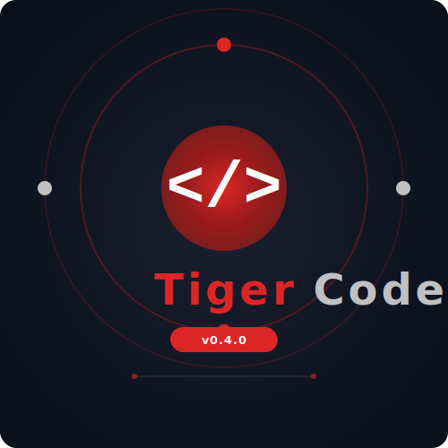

# Tiger Code Pilot

<p align="center">
  
</p>

<p align="center">
  <strong>Agentic AI Copilot for VS Code</strong>
</p>

<p align="center">
  
  
  
</p>

---

## What Is It?

Tiger Code Pilot is an open-source, agentic AI coding assistant that runs inside VS Code. It connects to multiple AI providers (OpenAI, HuggingFace, Ollama, local endpoints) and provides a multi-mode workflow for brainstorming, research, code generation, debugging, and project design.

The project is split into two independent pieces built in parallel by two AI agents:
- **Frontend Piece** — VS Code extension, chat UI, theming, panel management (built by Qwen Code)
- **Backend Piece** — Core engine, AI routing, agent orchestration, streaming, local server (built by Amazon Q)

## Features

### Current
- [x] Multi-provider AI support (OpenAI, HuggingFace, Ollama, local endpoints)
- [x] Chat panel with dark theme and animated `</>` logo
- [x] Quick action buttons: Analyze, Explain, Refactor, Tests, Debug, Optimize
- [x] Code context loading from active editor
- [x] Prompt saving and loading
- [x] API key secure storage via `vscode.SecretStorage`
- [x] Onboarding wizard with free model setup
- [x] Provider/model preferences persisted
- [x] Panel reuse (no duplicate windows)
- [x] Progress dashboard for agent tasks
- [x] Streaming support with graceful fallback
- [x] Core engine stub ready for backend team

### Planned
- [ ] Real-time streaming responses (waiting on backend)
- [ ] Sidebar/tree view for persistent panel access
- [ ] Agent task execution with live step tracking
- [ ] Concept-to-reality mode (natural language → working code)
- [ ] VibeCode mode (conversational code generation)
- [ ] Multi-file code editing across project
- [ ] Local model auto-download and caching
- [ ] Provider health monitoring and auto-failover

## Architecture

```
┌─────────────────────────────────────────────────────────────┐
│                     VS Code Extension                       │
│  ┌─────────────┐  ┌──────────────┐  ┌──────────────────┐   │
│  │ Chat Panel  │  │ Quick Actions│  │ Progress Dashboard│   │
│  │ (webview)   │  │ (code symbols)│  │ (step tracking)   │   │
│  └──────┬──────┘  └──────┬───────┘  └────────┬─────────┘   │
│         │                 │                    │              │
│         └─────────────────┼────────────────────┘              │
│                           │                                    │
│                  ┌────────▼────────┐                          │
│                  │  Core Engine    │  ← Amazon Q is building  │
│                  │  (AI Router)    │     the real version     │
│                  └────────┬────────┘                          │
│                           │                                    │
│         ┌─────────────────┼─────────────────┐                │
│         │                 │                  │                 │
│  ┌──────▼──────┐  ┌──────▼──────┐  ┌───────▼────────┐       │
│  │ Cloud APIs  │  │ Ollama      │  │ Local Server   │       │
│  │ (OpenAI,    │  │ (Local)     │  │ (coming soon)  │       │
│  │  HuggingFace)│ │             │  │                │       │
│  └─────────────┘  └─────────────┘  └────────────────┘       │
└─────────────────────────────────────────────────────────────┘
```

### Project Structure

```
code-pilot-project/
├── src/
│   ├── extension.ts          # VS Code extension entry point
│   ├── core-engine.js        # AI routing stub (being replaced by backend)
│   ├── cli.js                # CLI tool for terminal usage
│   ├── mcp-server.js         # MCP server for AI tool integration
│   ├── ui/
│   │   ├── webview.html       # Chat panel UI
│   │   ├── progress-dashboard.html  # Agent progress dashboard
│   │   ├── theme.js           # UI theme tokens (brand red)
│   │   └── cli-visuals.js     # Terminal visual helpers
│   └── test/                  # Extension tests
├── images/
│   ├── logo.svg               # Main logo (Agent Core design)
│   ├── logo-vscode.svg        # VS Code marketplace banner
│   ├── logo-agent-core.svg    # Agent Core logo variant
│   ├── logo-dark-core.svg     # Dark Core logo variant
│   ├── icon-64.svg            # 64px app icon
│   └── icon.png               # Packaged extension icon
├── FRONTEND_PIECE.md          # Frontend scope and API contract
├── BACKEND_PIECE.md           # Backend scope (Amazon Q's domain)
└── ARCHITECTURE.md            # Full system architecture
```

## Quick Start

### Prerequisites
- Node 18+ (recommended 20+)
- npm 9+
- VS Code 1.90+

### Development Setup
```bash
git clone https://github.com/yourname/tiger-code-pilot.git
cd tiger-code-pilot
npm install
npm run compile
```

### Run in VS Code
1. Open the project folder in VS Code
2. Press `F5` to launch the Extension Development Host
3. A new VS Code window opens with Tiger Code Pilot active
4. Open Command Palette (`Ctrl+Shift+P`) and run:
   - `Tiger Code Pilot: Quick Start / Onboarding` — First-time setup
   - `Tiger Code Pilot: Open Chat` — Open the chat panel
   - `Tiger Code Pilot: Analyze Code` — Analyze selected code
   - `Tiger Code Pilot: Agent Progress` — View agent task progress

### First Run
The onboarding wizard guides you through:
1. **Free Model** — HuggingFace free tier (no API key needed)
2. **Local Model** — Ollama on your machine (fully private)
3. **OpenAI** — GPT-4o models (requires API key)

## Available Commands

| Command | Description |
|---|---|
| `Tiger Code Pilot: Open Chat` | Open the AI chat panel |
| `Tiger Code Pilot: Analyze Code` | Analyze selected code |
| `Tiger Code Pilot: Quick Start / Onboarding` | First-time setup wizard |
| `Tiger Code Pilot: Test Connection` | Test AI provider connection |
| `Tiger Code Pilot: Agent Progress` | View agent task progress |

## Quick Actions

Inside the chat panel, six quick actions auto-load your selected editor code:

| Button | Symbol | Purpose |
|---|---|---|
| Analyze Code | `<?>` | Code quality, bugs, improvements |
| Explain | `{ }` | What the code does |
| Refactor | `</>` | Cleaner, more maintainable code |
| Write Tests | `[ ]` | Comprehensive unit tests |
| Debug | `<!>` | Find and fix bugs |
| Optimize | `^^` | Performance improvements |

## Design System

The UI uses brand red `#dc2626` with silver `#c0c0c0` accents. All emojis have been replaced with developer-friendly code symbols: `[OK]`, `[ERR]`, `[WARN]`, `[INFO]`, `<?>`, `{ }`, `</>`, `[ ]`, `<!>`, `^^`.

## Packaging

```bash
npm run compile
vsce package    # generates .vsix
```

## Roadmap

### Phase 1: Core Infrastructure ✅ DONE
- [x] CLI tool
- [x] Provider registry
- [x] Model catalog
- [x] HTTP server
- [x] MCP server
- [x] VS Code extension with chat UI
- [x] Onboarding wizard
- [x] Brand identity (logos, colors, symbols)

### Phase 2: Backend Core Engine ⏳ NOW (Amazon Q)
- [ ] Real AI routing across providers
- [ ] Streaming responses
- [ ] Provider health monitoring
- [ ] Auto-failover between providers
- [ ] VibeCode natural language mode
- [ ] Concept-to-reality agent

### Phase 3: Agent System ⏳
- [ ] Local agent for autonomous tasks
- [ ] Multi-step planning and execution
- [ ] File system operations
- [ ] Git integration
- [ ] Progress tracking with live updates

### Phase 4: Integration ⏳
- [ ] End-to-end testing
- [ ] Sidebar/tree view
- [ ] Multi-file editing
- [ ] Local model caching
- [ ] Marketplace release

## Contributing

Use GitHub issues/PRs. For AI content, follow responsible AI guidelines.

This project is being built by two AI agents working in parallel:
- **Qwen Code** — Frontend / Extension piece
- **Amazon Q** — Backend / Core engine piece

## License

Apache 2.0 — free to use, modify, and distribute with patent protection.
